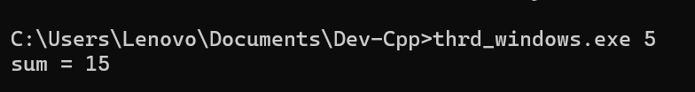

Laporan Praktikum
Sistem Oprasi

Dosen Pengampu :
 Dr Ferry Astika Saputra ST, M.Sc

Oleh :
Naf’an Nashohu Zayyan
3124521008
D3 IT A

Politeknik Elektronika Negeri Surabaya
(PENS) LA 2025

1.	Konsep Single Thread vs Multithread
Pada sistem single-thread, sebuah program dieksekusi hanya dengan satu alur eksekusi (thread) dari awal hingga akhir secara berurutan. Artinya, setiap tugas harus menunggu tugas sebelumnya selesai sebelum dimulai. Model ini sederhana dan mudah dipahami, tetapi tidak efisien untuk tugas-tugas yang bisa dilakukan bersamaan (misalnya input/output dan komputasi). Contoh: Sebuah aplikasi membaca file, lalu menunggu selesai sebelum memproses data—hal ini bisa membuat aplikasi terlihat lambat atau "macet".
Sebaliknya, sistem multithread memungkinkan sebuah program memiliki beberapa alur eksekusi (thread) yang berjalan secara bersamaan (concurrent). Ini memungkinkan CPU memanfaatkan waktu secara efisien, terutama pada sistem multi-core. Misalnya, satu thread dapat menangani input dari pengguna, sementara thread lain memproses data atau melakukan perhitungan. Dengan multithreading, program bisa menjadi lebih responsif, cepat, dan optimal untuk pekerjaan berat seperti simulasi, rendering, atau operasi jaringan.
 
2.	A. SumTask.java 
Penerapan thread pada SumTask.java menggunakan konsep Fork/Join Framework di Java, yang secara khusus dirancang untuk menyelesaikan tugas-tugas besar yang bisa dipecah (divide) menjadi tugas-tugas kecil, dan dijalankan secara paralel (conquer). Pada program ini, SumTask merupakan turunan dari RecursiveTask yang memungkinkan kita menghitung jumlah elemen dari sebuah array besar secara efisien menggunakan banyak thread.
Ketika ukuran bagian array yang akan dihitung lebih kecil dari ambang batas (THRESHOLD), tugas akan langsung dihitung secara sekuensial. Namun jika lebih besar, maka tugas akan dibagi dua, dan masing-masing akan diproses dalam thread terpisah menggunakan fork(). Setelah kedua sub-task selesai, hasilnya digabung menggunakan join(). Dengan menggunakan ForkJoinPool, seluruh proses pembagian dan penggabungan dikelola secara otomatis, sehingga thread dapat berjalan secara paralel untuk meningkatkan performa komputasi.
Code :
/**
 * Fork/join parallelism in Java
 * Figure 4.18
 * @author Gagne, Galvin, Silberschatz
 * Operating System Concepts  - Tenth Edition
 * Copyright John Wiley & Sons - 2018
 */

 import java.util.concurrent.*;

 public class SumTask extends RecursiveTask<Integer>
 {
     static final int SIZE = 10000;
     static final int THRESHOLD = 1000;
 
     private int begin;
     private int end;
     private int[] array;
 
     public SumTask(int begin, int end, int[] array) {
         this.begin = begin;
         this.end = end;
         this.array = array;
     }
 
     protected Integer compute() {
         if (end - begin < THRESHOLD) {
             // conquer stage 
             int sum = 0;
             for (int i = begin; i <= end; i++)
                 sum += array[i];
 
             return sum;
         }
         else {
             // divide stage 
             int mid = begin + (end - begin) / 2;
             
             SumTask leftTask = new SumTask(begin, mid, array);
             SumTask rightTask = new SumTask(mid + 1, end, array);
 
             leftTask.fork();
             rightTask.fork();
 
             return rightTask.join() + leftTask.join();
         }
     }
 
     public static void main(String[] args) {
         ForkJoinPool pool = new ForkJoinPool();
         int[] array = new int[SIZE];
 
         // create SIZE random integers between 0 and 9
         java.util.Random rand = new java.util.Random();
 
         for (int i = 0; i < SIZE; i++) {
             array[i] = rand.nextInt(10);
         }      
         
         // use fork-join parallelism to sum the array
         SumTask task = new SumTask(0, SIZE-1, array);
 
         int sum = pool.invoke(task);
 
         System.out.println("The sum is " + sum);
     }
 }

Output :
 
 

B.  thrd-posix.c
•	Penjelasan essay
Pada kode thrd-posix.c, penerapan thread dilakukan dengan menggunakan pustaka pthread, yang merupakan standar POSIX untuk pemrograman multithreading di sistem operasi berbasis Unix/Linux. Program ini membuat satu thread baru yang akan menjalankan fungsi runner, di mana ia menghitung jumlah dari angka 1 hingga nilai yang diberikan sebagai argumen program.
Fungsi utama (main) mengatur atribut thread menggunakan pthread_attr_init, lalu membuat thread dengan pthread_create. Data parameter disalin secara aman ke memori heap agar bisa diakses oleh thread, dan dibebaskan kembali di akhir fungsi runner dengan free(). Setelah thread selesai, pthread_join dipanggil untuk menunggu thread selesai sebelum program utama mencetak hasil. Pendekatan ini mencerminkan pemanfaatan thread untuk menjalankan proses secara independen dari main thread namun tetap terkendali.
Code :
/**
 * A pthread program illustrating how to
 * create a simple thread and some of the pthread API
 * This program implements the summation function where
 * the summation operation is run as a separate thread.
 *
 * Most Unix/Linux/OS X users
 * gcc thrd.c -lpthread
 *
 * Figure 4.11
 *
 * @author Gagne, Galvin, Silberschatz
 * Operating System Concepts  - Tenth Edition
 * Copyright John Wiley & Sons - 2018
 */

#include <pthread.h>
#include <stdio.h>
#include <stdlib.h>

int sum; /* this data is shared by the thread(s) */

void *runner(void *param); /* the thread */

int main(int argc, char *argv[])
{
pthread_t tid; /* the thread identifier */
pthread_attr_t attr; /* set of attributes for the thread */

if (argc != 2) {
    fprintf(stderr,"usage: a.out <integer value>\n");
    /*exit(1);*/
    return -1;
}

if (atoi(argv[1]) < 0) {
    fprintf(stderr,"Argument %d must be non-negative\n",atoi(argv[1]));
    /*exit(1);*/
    return -1;
}

/* get the default attributes */
pthread_attr_init(&attr);

/* create the thread */
pthread_create(&tid,&attr,runner,argv[1]);

/* now wait for the thread to exit */
pthread_join(tid,NULL);

printf("sum = %d\n",sum);
}

/**
 * The thread will begin control in this function
 */
void *runner(void *param) 
{
int i, upper = atoi(param);
sum = 0;

    if (upper > 0) {
        for (i = 1; i <= upper; i++)
            sum += i;
    }

    pthread_exit(0);
}

C. thrd-Win32.c
•	 Penjelasan essay
Meskipun judulnya thrd-win32.c, kode ini sebenarnya masih menggunakan pustaka pthread, sehingga dapat berjalan di Windows asalkan pustaka pthread terinstal atau digunakan melalui tools seperti MinGW atau Cygwin. Fungsionalitasnya identik dengan versi Linux: membuat thread untuk menjalankan fungsi runner yang menghitung jumlah dari 1 hingga nilai yang diberikan.
Sama seperti sebelumnya, parameter disalin secara eksplisit menggunakan malloc dan strcpy, thread dijalankan menggunakan pthread_create, dan setelah selesai diproses, thread ditunggu dengan pthread_join. Pendekatan ini menunjukkan bahwa meskipun berada di platform berbeda, pemrograman multithread dapat dilakukan dengan cara yang serupa jika menggunakan pustaka portable seperti POSIX thread.
Code :
/**
 * This program creates a separate thread using the CreateThread() system call.
 *
 * Figure 4.13
 *
 * @author Gagne, Galvin, Silberschatz
 * Operating System Concepts  - Tenth Edition
 * Copyright John Wiley & Sons - 2018
 */

#include <stdio.h>
#include <windows.h>

DWORD Sum; /* data is shared by the thread(s) */

/* the thread runs in this separate function */
DWORD WINAPI Summation(PVOID Param)
{
    DWORD Upper = *(DWORD *)Param;

    for (DWORD i = 0; i <= Upper; i++)
        Sum += i;

    return 0;
}

int main(int argc, char *argv[])
{
    DWORD ThreadId;
    HANDLE ThreadHandle;
    int Param;

    // do some basic error checking
    if (argc != 2) {
        fprintf(stderr,"An integer parameter is required\n");
        return -1;
    }

    Param = atoi(argv[1]);

    if (Param < 0) {
        fprintf(stderr, "an integer >= 0 is required \n");
        return -1;
    }

    // create the thread
    ThreadHandle = CreateThread(NULL, 0, Summation, &Param, 0, &ThreadId);

    if (ThreadHandle != NULL) {
        WaitForSingleObject(ThreadHandle, INFINITE);
        CloseHandle(ThreadHandle);
        printf("sum = %d\n",Sum);
    }
}

Output :

Jawaban Soal 
4.1 
1.	Pengolahan Gambar (Image Processing):
Saat memproses gambar beresolusi tinggi (misalnya filter atau transformasi), setiap bagian gambar bisa diproses oleh thread yang berbeda secara paralel, mempercepat keseluruhan proses.
2.	Server Web Multiklien:
Web server seperti Apache atau Nginx menggunakan multithreading untuk menangani banyak permintaan dari klien secara bersamaan. Setiap permintaan ditangani oleh thread berbeda, memungkinkan server tetap responsif.
3.	Simulasi Fisika atau Permainan (Game Physics Simulation):
Dalam game atau simulasi, perhitungan fisika untuk objek-objek berbeda (seperti tumbukan, gravitasi) dapat dilakukan secara paralel dengan multithreading.

4.2 
Amdahl's Law Formula:
Speedup=1(1−P)+PN\text{Speedup} = \frac{1}{(1 - P) + \frac{P}{N}}Speedup=(1−P)+NP1 
Keterangan:
•	P = proporsi program yang dapat diparalelkan (0.60)
•	N = jumlah core pemrosesan
(a) Dua core (N = 2):
Speedup=1(1−0.60)+0.602=10.40+0.30=10.70≈1.43\text{Speedup} = \frac{1}{(1 - 0.60) + \frac{0.60}{2}} = \frac{1}{0.40 + 0.30} = \frac{1}{0.70} \approx 1.43Speedup=(1−0.60)+20.601=0.40+0.301=0.701≈1.43 
(b) Empat core (N = 4):
Speedup=1(1−0.60)+0.604=10.40+0.15=10.55≈1.82\text{Speedup} = \frac{1}{(1 - 0.60) + \frac{0.60}{4}} = \frac{1}{0.40 + 0.15} = \frac{1}{0.55} \approx 1.82Speedup=(1−0.60)+40.601=0.40+0.151=0.551≈1.82 
Jawaban Ringkas:
•	(a) Speedup dengan 2 core ≈ 1.43
•	(b) Speedup dengan 4 core ≈ 1.82

4.3
Web server multithreaded menggunakan task parallelism, karena setiap thread menangani permintaan (request) klien yang berbeda, dan masing-masing menjalankan tugas yang berbeda (misalnya membaca file, mengirim data, dll), bukan memproses bagian berbeda dari data yang sama.

4.4
•  Perbedaan:
1.	User-level threads (ULT): Dikelola oleh user-level library, tidak diketahui oleh kernel. Kernel-level threads (KLT): Dikelola oleh sistem operasi dan dikenali oleh kernel.
2.	Context switching ULT: Lebih cepat karena tidak melibatkan mode kernel.
Context switching KLT: Lebih lambat karena memerlukan intervensi kernel.
•  Kapan lebih baik:
•	ULT lebih baik di sistem tanpa dukungan multithread oleh kernel atau ketika performa context-switching penting.
•	KLT lebih baik ketika diperlukan paralelisme sejati di multiprosesor karena bisa dijadwalkan di beberapa core.

4.5
•  Simpan status (register, counter) dari thread yang sedang berjalan ke Thread Control Block (TCB).
•  Update data struktur scheduler (misalnya daftar antrian ready).
•  Pilih thread tujuan untuk dijalankan dari antrian.
•  Muat status (register, counter) dari thread baru dari TCB.
•  Transfer kontrol ke thread baru.

4.6
•	Thread:
o	Stack sendiri
o	Program counter, register
o	Thread Control Block
o	Berbagi sumber daya dengan thread lain dalam proses yang sama (memori, file descriptor)
•	Proses:
o	Semua sumber daya thread + memori sendiri, ruang alamat terpisah, file descriptor sendiri, PCB (Process Control Block)
Perbedaan utama: Thread berbagi memori dan sumber daya, sementara proses memiliki salinan sendiri.

4.7
Jawaban: Ya, perlu mengikat (bind) real-time thread ke LWP karena:
•	Real-time thread membutuhkan jaminan eksekusi langsung dan prioritas tinggi.
•	Tanpa binding, thread mungkin tidak langsung dijadwalkan oleh kernel, karena user-level scheduler bisa menunda eksekusinya.
•	Dengan mengikat ke LWP, real-time thread dapat langsung dijadwalkan oleh kernel dan memenuhi deadline real-time system.

4.8
Contoh program di mana multithreading tidak memberikan performa lebih baik:
1.	Program Sederhana Tanpa Operasi Paralel:
Seperti program yang hanya melakukan operasi sequential kecil (misalnya menghitung jumlah angka dalam array kecil), multithreading bisa justru menambah overhead.
2.	Aplikasi yang Banyak Mengakses Sumber Daya Bersama (Shared Resource):
Misalnya aplikasi database yang sering melakukan locking pada data, sehingga thread harus menunggu giliran.

4.9
Ketika aplikasi harus menunggu I/O (input/output), seperti membaca dari disk atau jaringan. Thread lain bisa tetap berjalan saat satu thread menunggu, meningkatkan utilisasi CPU.

4.10
b. Heap memory
c. Global variables
4.11
Tidak, karena user-level threads tidak diketahui oleh kernel. Di sistem multiprosesor, kernel hanya menjadwalkan proses, bukan thread-thread internalnya, sehingga tidak bisa memanfaatkan semua core secara paralel.

4.12
Tidak. Proses terpisah menawarkan isolasi lebih baik — jika satu tab crash, tab lain tetap berjalan. Jika menggunakan thread, semua berbagi memori dan satu crash bisa mematikan seluruh aplikasi.

4.13
Ya. Pada sistem single-core, dua atau lebih tugas bisa berjalan seolah-olah bersamaan (concurrent) melalui switching cepat, meski tidak berjalan secara paralel secara fisik.

4.14
Speedup=1(1−P)+PN\text{Speedup} = \frac{1}{(1 - P) + \frac{P}{N}}Speedup=(1−P)+NP1 
1. 40% parallel:
•	a) 8 core → 10.6+0.48=10.6+0.05=10.65≈1.54\frac{1}{0.6 + \frac{0.4}{8}} = \frac{1}{0.6 + 0.05} = \frac{1}{0.65} \approx 1.540.6+80.41=0.6+0.051=0.651≈1.54
•	b) 16 core → 10.6+0.416=10.6+0.025=10.625≈1.60\frac{1}{0.6 + \frac{0.4}{16}} = \frac{1}{0.6 + 0.025} = \frac{1}{0.625} \approx 1.600.6+160.41=0.6+0.0251=0.6251≈1.60
2. 67% parallel:
•	a) 2 core → 10.33+0.672=10.33+0.335=10.665≈1.50\frac{1}{0.33 + \frac{0.67}{2}} = \frac{1}{0.33 + 0.335} = \frac{1}{0.665} \approx 1.500.33+20.671=0.33+0.3351=0.6651≈1.50
•	b) 4 core → 10.33+0.674=10.33+0.1675=10.4975≈2.01\frac{1}{0.33 + \frac{0.67}{4}} = \frac{1}{0.33 + 0.1675} = \frac{1}{0.4975} \approx 2.010.33+40.671=0.33+0.16751=0.49751≈2.01
3. 90% parallel:
•	a) 4 core → 10.1+0.94=10.1+0.225=10.325≈3.08\frac{1}{0.1 + \frac{0.9}{4}} = \frac{1}{0.1 + 0.225} = \frac{1}{0.325} \approx 3.080.1+40.91=0.1+0.2251=0.3251≈3.08
•	b) 8 core → 10.1+0.98=10.1+0.1125=10.2125≈4.71\frac{1}{0.1 + \frac{0.9}{8}} = \frac{1}{0.1 + 0.1125} = \frac{1}{0.2125} \approx 4.710.1+80.91=0.1+0.11251=0.21251≈4.71

4.15
•  Thread untuk thumbnail setiap foto → Task parallelism
•  Transposing matrix in parallel → Data parallelism
•  Network app, satu thread baca satu tulis → Task parallelism
•  Fork-join array summation → Data parallelism
•  Grand Central Dispatch (GCD) → Task parallelism (tapi bisa digunakan untuk data juga, tergantung implementasi)

4.16
•  Thread untuk input/output:
1 thread saja, karena I/O hanya terjadi sekali di awal dan akhir program.
•  Thread untuk CPU-bound:
4 thread, agar memaksimalkan 4 core yang tersedia dan mencapai performa terbaik.

4.17
a. Berapa banyak proses unik yang dibuat?
➡️ 4 proses
(1 parent → fork → 2, then inside child fork → 3, and both child and parent do another fork → 4 total)
b. Berapa banyak thread unik yang dibuat?
➡️ 5 threads
(Setiap proses punya satu thread default, lalu thread_create() menambah 1 thread dalam salah satu proses → 4 + 1 = 5)

4.18
Perbedaan pendekatan Linux vs Windows:
•	Linux:
Tidak membedakan proses dan thread. Semuanya dianggap task dan dikontrol melalui flag di clone().
•	Windows (dan lainnya):
Memisahkan proses dan thread. Setiap proses memiliki daftar/pointer ke thread-thread-nya.
Kesimpulan:
Linux fleksibel dan efisien karena satu sistem untuk keduanya. Sistem lain lebih eksplisit, membuat manajemen dan debugging lebih mudah.

4.19
Urutkan sistem penyimpanan berikut dari yang paling lambat ke yang paling cepat:
a. Hard-disk drives b. Registers c. Optical disk d. Main memory e. Nonvolatile memory f. Magnetic tapes g. Cache
Urutan dari yang paling lambat ke yang paling cepat:
Magnetic tapes (f)
Optical disk (c)
Hard-disk drives (a)
Nonvolatile memory (e)
Main memory (d)
Cache (g)
Registers (b)

4.20
a. Kernel threads < jumlah core:
➡️ Underutilization. Beberapa core menganggur → performa kurang optimal.
b. Kernel threads = jumlah core:
➡️ Ideal. Semua core bisa dipakai tanpa overload → performa maksimal.
c. Kernel threads > core, tapi < user threads:
➡️ Context switching meningkat, tapi tetap bisa paralel. Performa baik, tapi tidak seoptimal (b).

4.21
Operasi yang cocok dilakukan saat pembatalan dinonaktifkan:
1.	Menulis ke file log
→ Hindari terpotong saat menulis agar log tidak korup.
2.	Membebaskan resource penting (misalnya malloc/free)
→ Supaya tidak terjadi memory leak jika thread dibatalkan di tengah proses.

4.22
Deskripsi:
Program menerima list angka dari command line, dan membuat 3 thread:
•	Thread 1: Hitung rata-rata.
•	Thread 2: Cari nilai maksimum.
•	Thread 3: Cari nilai minimum.
Contoh output:
csharp
SalinEdit
The average value is 82
The minimum value is 72
The maximum value is 95
Penjelasan singkat: Gunakan variabel global untuk avg, min, dan max. Setelah ketiga thread selesai, cetak hasil di thread utama (main).

4.23
Deskripsi:
•	User memasukkan sebuah angka lewat command line.
•	Program membuat 1 thread untuk mencetak semua bilangan prima ≤ angka tersebut.
Contoh input/output:
makefile
SalinEdit
Input: 20  
Output: 2 3 5 7 11 13 17 19
Penjelasan singkat: Thread melakukan loop dari 2 hingga n, dan mengecek apakah bilangan tersebut prima lalu mencetaknya.

4.24
Deskripsi:
•	Program membuat thread untuk menghasilkan titik (x, y) acak dalam kotak berukuran 2x2.
•	Hitung berapa banyak titik yang jatuh ke dalam lingkaran berjari-jari 1.
•	Estimasi π menggunakan rumus:
π=4×jumlah titik dalam lingkaranjumlah total titik\pi = 4 \times \frac{\text{jumlah titik dalam lingkaran}}{\text{jumlah total titik}}π=4×jumlah total titikjumlah titik dalam lingkaran 
Penjelasan singkat: Thread menghitung dan menyimpan jumlah titik yang jatuh di dalam lingkaran. Setelah thread selesai, thread utama menghitung nilai π dan mencetak hasilnya.

4.25 
Apa beberapa keuntungan sistem peer-to-peer dibandingkan sistem client-server?
Keuntungan sistem peer-to-peer dibandingkan client-server:

Skalabilitas yang lebih baik - Kapasitas sistem meningkat dengan setiap node baru
Tidak ada single point of failure - Sistem tetap berfungsi meski beberapa node gagal
Pemanfaatan sumber daya yang lebih efisien - Menggunakan idle resources dari semua node
Biaya infrastruktur lebih rendah - Tidak memerlukan server pusat yang mahal
Ketersediaan data lebih tinggi melalui replikasi
Ketahanan terhadap serangan DDoS karena tidak ada target tunggal
Redundansi alami yang meningkatkan kehandalan sistem
Distribusi beban otomatis di antara peer yang tersedia

4.26
elaskan beberapa aplikasi terdistribusi yang sesuai untuk sistem peer-to-peer.
Aplikasi terdistribusi yang sesuai untuk sistem peer-to-peer:

Berbagi file (seperti BitTorrent)
Streaming konten dan distribusi video
Komunikasi dan pesan instan terdesentralisasi
Komputasi terdistribusi untuk proyek penelitian ilmiah
Penyimpanan data terdistribusi dan backup
Cryptocurrency dan blockchain
Database terdistribusi
Sistem manajemen konten kolaboratif
Game multipemain terdesentralisasi
Sistem pencarian terdistribusi

4.27
Buat thread untuk menghitung Fibonacci sebanyak n angka. Simpan hasil dalam array global, lalu main thread menunggu dengan pthread_join dan mencetak hasil setelah thread selesai.

4.28
Buat 100 thread, tiap thread:
•	Meminta PID
•	sleep() random
•	Melepas PID
Gunakan mutex untuk sinkronisasi saat alokasi dan dealokasi PID.

4.29
Modifikasi echo server Java menjadi multi-threaded:
Setiap kali menerima koneksi, buat thread baru untuk menangani client:
java
SalinEdit
new Thread(() -> handleClient(clientSocket)).start();

