<div align="center">
  
# UAS 2 Sistem Oprasi


# Dosen Pengampu : Dr Ferry Astika Saputra ST, M.Sc

# Oleh : Naf’an Nashohu Zayyan 3124521008 D3 IT A

# Politeknik Elektronika Negeri Surabaya (PENS) LA 2025
</div>


## **1. Penjelasan tentang Scheduler (dengan gambar)**

###  **Long-Term Scheduler**

* Mengatur proses dari penyimpanan sekunder ke memori utama.
* Mengontrol **jumlah proses** yang masuk ke sistem.
* Jarang dipanggil.

###  **Medium-Term Scheduler**

* Bertanggung jawab melakukan **suspensi dan resume** proses.
* Digunakan untuk mengatur beban kerja dalam memori utama.

###  **Short-Term Scheduler**

* Juga dikenal sebagai **CPU scheduler**.
* Memilih proses dari **ready queue** untuk dieksekusi oleh CPU.
* Paling sering dipanggil.


###  Gambar Penjadwalan CPU:

 


## **2. Penyelesaian Penjadwalan SJF Preemptive dan Round Robin (QT=4)**

###  **Diketahui:**
```
| Proses | Arrival Time | Burst Time |
| ------ | ------------ | ---------- |
| P1     | 0            | 7          |
| P2     | 3            | 4          |
| P3     | 6            | 1          |
| P4     | 7            | 4          |
| P5     | 9            | 5          |
| P6     | 10           | 3          |
```


## A. **SJF Preemptive (Shortest Remaining Time First)**

###  Gantt Chart:

```mermaid

gantt
    title Gantt Chart - SJF Preemptive
    dateFormat  x
    section Proses
    P1        :active, 0, 3
    P2        :active, 3, 3
    P3        :active, 6, 1
    P2        :active, 7, 2
    P4        :active, 9, 1
    P6        :active, 10, 3
    P5        :active, 13, 3
    P1        :active, 16, 5

 
```



###  Perhitungan:
```
| Proses | Arrival | Burst | Completion | Turnaround  | Waiting |
| ------ | ------- | ----- | ---------- | ----------- | ------- |
| P1     | 0       | 7     | 21         | 21 - 0 = 21 | 14      |
| P2     | 3       | 4     | 9          | 6           | 2       |
| P3     | 6       | 1     | 7          | 1           | 0       |
| P4     | 7       | 4     | 10         | 3           | -1      |
| P5     | 9       | 5     | 16         | 7           | 2       |
| P6     | 10      | 3     | 13         | 3           | 0       |
```

###  Rangkuman:

* **Average Waiting Time** ≈ (14 + 2 + 0 + 0 + 2 + 0) / 6 = **3.0**
* **Average Turnaround Time** = (21 + 6 + 1 + 3 + 7 + 3) / 6 = **6.83**
* **Context Switches**: 7 (antara setiap perubahan proses)


## B. **Round Robin (Quantum Time = 4)**

###  Gantt Chart (simulasi):

```mermaid

gantt
    title Gantt Chart - Round Robin (QT = 4)
    dateFormat  x
    section Proses
    P1  :active, 0, 4
    P2  :active, 4, 4
    P1  :active, 8, 4
    P3  :active, 12, 1
    P4  :active, 13, 4
    P5  :active, 17, 4
    P6  :active, 21, 3
    P5  :active, 24, 1
    P1  :active, 25, 2

```



###  Perhitungan:
```
| Proses | Arrival | Burst | Completion | Turnaround | Waiting |
| ------ | ------- | ----- | ---------- | ---------- | ------- |
| P1     | 0       | 7     | 27         | 27         | 20      |
| P2     | 3       | 4     | 8          | 5          | 1       |
| P3     | 6       | 1     | 13         | 7          | 6       |
| P4     | 7       | 4     | 17         | 10         | 6       |
| P5     | 9       | 5     | 25         | 16         | 11      |
| P6     | 10      | 3     | 24         | 14         | 11      |
```
###  Rangkuman:

* **Average Waiting Time** = (20 + 1 + 6 + 6 + 11 + 11) / 6 = **9.17**
* **Average Turnaround Time** = (27 + 5 + 7 + 10 + 16 + 14) / 6 = **13.17**
* **Context Switches**: 8


##  **Perbandingan SJF vs RR (QT = 4)**
```
| Metric               | SJF Preemptive | Round Robin (QT=4) |
| -------------------- | -------------- | ------------------ |
| Average Waiting Time | **3.0**        | 9.17               |
| Avg Turnaround Time  | 6.83           | **13.17**          |
| Context Switches     | 7              | **8**              |
```

 
